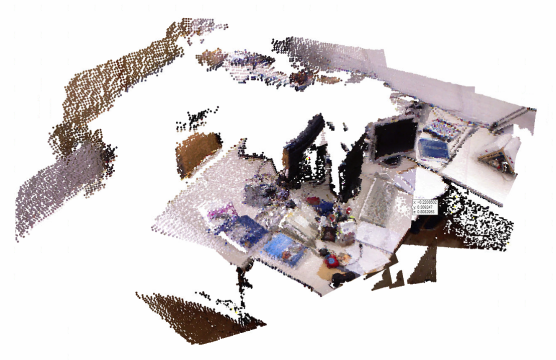

## Overview
gradslam is a fully differentiable dense SLAM framework. It provides a repository of differentiable building blocks for a dense SLAM system, such as differentiable nonlinear least squares solvers, differentiable ICP (iterative closest point) techniques, differentiable raycasting modules, and differentiable mapping/fusion blocks. One can use these blocks to construct SLAM systems that allow gradients to flow all the way from the outputs of the system (map, trajectory) to the inputs (raw color/depth images, parameters, calibration, etc.).

```python
rgbdimages = RGBDImages(colors, depths, intrinsics)
slam = PointFusion()
pointclouds, recovered_poses = slam(rgbdimages)
pointclouds.plotly(0).show()
```


## Installation

### Requirements
- `pytorch>=1.6.0` (for other pytorch versions see [here](#install-from-local-clone-recommended))

### Using pip (Experimental)

`pip install gradslam`

### Install from GitHub

`pip install 'git+https://github.com/gradslam/gradslam.git'`

### Install from local clone (Recommended)

pip install chamferdist
cd ..
git clone https://github.com/gradslam/gradslam.git
cd gradslam
pip install -e .[dev]
```

### Verifying the installation

To verify if `gradslam` has successfully been built, fire up the python interpreter, and import!

```py
import gradslam as gs
print(gs.__version__)
```

You should see the version number displayed.
```


## Contributors

* Soroush Saryazdi
* Krishna Murthy Jatavallabhula
* Ganesh Iyer
